---

### About Me

Fullstack Developer with hands-on experience building web and mobile applications using **React, Next.js, Flutter, Python, and C#/.NET**. I enjoy building data-driven systems with REST API integrations and modern cloud databases. Currently pursuing a **Bachelor's degree in Information Systems** at Universitas Multimedia Nusantara.

- Information Systems student at Universitas Multimedia Nusantara (2022 – Present)
- Interested in Clean Architecture, microservices, and system design
- Reach me at **evan.sibara888@gmail.com**
- Based in Kab. Tangerang, Banten, Indonesia

---

### Tech Stack

---

